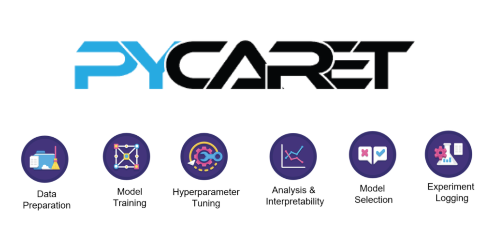

# Projeto-Deploy-ML-model-em-API-Diabetes

O Projeto tem a finalidade de criar um <strong>modelo proditivo de Classificação</strong>  de diabetes, fazer o <strong>deploy</strong>  do modelo serializado e disponibilizar numa <strong>API REST</strong> , e no final <strong>conteinerizar</strong> o produto em docker.

Para a modelagem e inferencia do modelo foi utilizada o <strong>Pycaret</strong>, uma livraria inovadora e eficiente para treinamento e comparação da performance dos modelos candidatos. Para a contrução da API foi utilizada principalmente a livraria <strong>Flask</strong>.    

